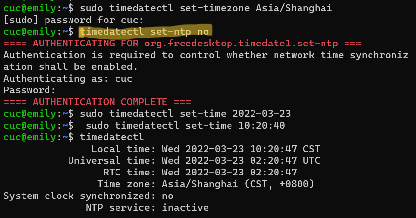

# 第三章实验报告

 ## systemd 命令
 [Systemd 入门教程：命令篇](http://www.ruanyifeng.com/blog/2016/03/systemd-tutorial-commands.html)

 ### systemctl
 ```
 # 重启系统
 $ sudo systemctl reboot
 # 关闭系统，切断电源
 $ sudo systemctl poweroff
 # CPU停止工作
 $ sudo systemctl halt
 # 暂停系统
 $ sudo systemctl suspend
 # 让系统进入冬眠状态
 $ sudo systemctl hibernate
 # 让系统进入交互式休眠状态
 $ sudo systemctl hybrid-sleep
 # 启动进入救援状态（单用户状态）
 $ sudo systemctl rescue
 ```
 [](https://asciinema.org/a/a73PdX2qSX6C8Lp6pzt1yLe2f)

 [](https://asciinema.org/a/w4vad5VAv1bEjNFSgdkesMGTM)

 ### systemd-analyze
 ```
 # 查看启动耗时
 $systemd-analyze                      
 # 查看每个服务的启动耗时
 $ systemd-analyze blame
 # 显示瀑布状的启动过程流
 $ systemd-analyze critical-chain
 # 显示指定服务的启动流
 $ systemd-analyze critical-chain atd.service
 ```
 [](https://asciinema.org/a/dKoTjAPw73LeOwiFAmXRGVxfm)

 ### hostnamectl
 ```
 # 显示当前主机的信息
 $ hostnamectl
 # 设置主机名
 $ sudo hostnamectl set-hostname rhel7
 ```
 [](https://asciinema.org/a/TKyrrjzQqc4IAyNsRRTyn7tlm)

 ### localectl
 ```
 # 查看本地化设置
 $ localectl
 # 设置本地化参数
 $ sudo localectl set-locale LANG=en_GB.utf8
 $ sudo localectl set-keymap en_GB
```
 [](https://asciinema.org/a/sj1g5yrwlcCjEi6Lv64YfCKqF)

 ### timedatectl
 ```
 # 查看当前时区设置
 $ timedatectl
 # 显示所有可用的时区
 $ timedatectl    list-timezones                        
 # 设置当前时区
 $ sudo timedatectl set-timezone      America/New_York
 $ sudo timedatectl set-time YYYY-MM-DD
 $ sudo timedatectl set-time HH:MM:SS
 ```
 [](https://asciinema.org/a/rXECQImbqYRwOkwxMLfOqNCPm)

 ### loginctl

 ```
 # 列出当前session
 $ loginctl list-sessions
 # 列出当前登录用户
 $ loginctl list-users
 # 列出显示指定用户的信息
 $ loginctl show-user ruanyf
 ```
 [](https://asciinema.org/a/7MuKJC7HNfSgSlUXsnzxszgAb)

 ### systemctl list-units
 ```
 # 列出正在运行的 Unit
 $ systemctl list-units
 # 列出所有Unit，包括没有找到配置文件的或者启动失败的
 $ systemctl list-units --all
 # 列出所有没有运行的 Unit
 $ systemctl list-units --all --state=inactive
 # 列出所有加载失败的 Unit
 $ systemctl list-units --failed
 # 列出所有正在运行的、类型为 service 的 Unit
 $ systemctl list-units --type=service
 ```
 [](https://asciinema.org/a/vkRSuxCn8gI0aF4PveCFEoqZR)

 ### Unit 的状态
 ```
 # 显示系统状态
 $ systemctl status
 # 显示单个 Unit 的状态
 $ sysystemctl status bluetooth.service
 # 显示远程主机的某个 Unit 的状态
 $ systemctl -H root@rhel7.example.com status httpd.service
 # 显示某个 Unit 是否正在运行
 $ systemctl is-active application.service
 # 显示某个 Unit 是否处于启动失败状态
 $ systemctl is-failed application.service
 # 显示某个 Unit 服务是否建立了启动链接
 $ systemctl is-enabled application.service
 ```
 [](https://asciinema.org/a/cIfbX5yuo96TuHzgS0CYKbWsj)

 [](https://asciinema.org/a/MyhVvp6U0Aki6dADEPTuCnQzw)

 ### Unit 管理
 ```
 # 立即启动一个服务
 $ sudo systemctl start apache.service
 # 立即停止一个服务
 $ sudo systemctl stop apache.service
 # 重启一个服务
 $ sudo systemctl restart apache.service
 # 杀死一个服务的所有子进程
 $ sudo systemctl kill apache.service
 # 重新加载一个服务的配置文件
 $ sudo systemctl reload apache.service
 # 重载所有修改过的配置文件
 $ sudo systemctl daemon-reload
 # 显示某个 Unit 的所有底层参数
 $ systemctl show httpd.service
 # 显示某个 Unit 的指定属性的值
 $ systemctl show -p CPUShares httpd.service
 # 设置某个 Unit 的指定属性
 $ sudo systemctl set-property httpd.service CPUShares=500
 ```
 [](https://asciinema.org/a/5tVMKNINP01Ijd97Ii9KG8GhZ)
 
 ### 依赖关系
 ```
 $ systemctl list-dependencies nginx.service
 $ systemctl list-dependencies --all nginx.service
 ```
 [](https://asciinema.org/a/Icx9aMn7HTWXd7fBho9RzBpCL)
 
 ### Unit配置文件
 ```
 $ sudo systemctl enable clamd@scan.service
 # 等同于
 $ sudo ln -s '/usr/lib/systemd/system/clamd@scan.service' '/etc/systemd/system/multi-user.target.wants/clamd@scan.service'
 ```
 [](https://asciinema.org/a/CQKDfDTDbnJkiMxD0sGEEXm2k)
 
 ### 配置文件的状态
 ```
 # 列出所有配置文件
 $ systemctl list-unit-files
 # 列出指定类型的配置文件
 $ systemctl list-unit-files --type=service
 ```
 ```
 $ systemctl list-unit-files
 UNIT FILE              STATE
 chronyd.service        enabled
 clamd@.service         static
 clamd@scan.service     disabled
 ```
 ```
 $ sudo systemctl daemon-reload
 $ sudo systemctl restart httpd.service
 ```
 [](https://asciinema.org/a/XkxH40vXYOGRtAjXXvYChfY8D)

 ### 配置文件的格式

 [](https://asciinema.org/a/V1hKvPgwcXNJbgfIHNkguct9T)

 ### target
 ```
 # 查看当前系统的所有 Target
 $ systemctl list-unit-files --type=target
 # 查看一个 Target 包含的所有 Unit
 $ systemctl list-dependencies multi-user.target
 # 查看启动时的默认 Target
 $ systemctl get-default
 # 设置启动时的默认 Target
 $ sudo systemctl set-default multi-user.target
 # 切换 Target 时，默认不关闭前一个 Target 启动的进程，
 # systemctl isolate 命令改变这种行为，
 # 关闭前一个 Target 里面所有不属于后一个 Target 的进程
 $ sudo systemctl isolate multi-user.target
 ```
 [](https://asciinema.org/a/pW97pUhvKXebV0lJl6Jo3T6No)

 ### 日志管理
 ```
 # 查看所有日志（默认情况下 ，只保存本次启动的日志）
 $ sudo journalctl
 # 查看内核日志（不显示应用日志）
 $ sudo journalctl -k
 # 查看系统本次启动的日志
 $ sudo journalctl -b
 $ sudo journalctl -b -0
 # 查看上一次启动的日志（需更改设置）
 $ sudo journalctl -b -1
 # 查看指定时间的日志
 $ sudo journalctl --since="2012-10-30 18:17:16"
 $ sudo journalctl --since "20 min ago"
 $ sudo journalctl --since yesterday
 $ sudo journalctl --since "2015-01-10" --until "2015-01-11 03:00"
 $ sudo journalctl --since 09:00 --until "1 hour ago"
 # 显示尾部的最新10行日志
 $ sudo journalctl -n
 # 显示尾部指定行数的日志
 $ sudo journalctl -n 20
 # 实时滚动显示最新日志
 $ sudo journalctl -f
 # 查看指定服务的日志
 $ sudo journalctl /usr/lib/systemd/systemd
 # 查看指定进程的日志
 $ sudo journalctl _PID=1
 # 查看某个路径的脚本的日志
 $ sudo journalctl /usr/bin/bash
 # 查看指定用户的日志
 $ sudo journalctl _UID=33 --since today
 # 查看某个 Unit 的日志
 $ sudo journalctl -u nginx.service
 $ sudo journalctl -u nginx.service --since today
 # 实时滚动显示某个 Unit 的最新日志
 $ sudo journalctl -u nginx.service -f
 # 合并显示多个 Unit 的日志
 $ journalctl -u nginx.service -u php-fpm.service --since today
 # 查看指定优先级（及其以上级别）的日志，共有8级
 $ sudo journalctl -p err -b
 # 日志默认分页输出，--no-pager 改为正常的标准输出
 $ sudo journalctl --no-pager
 # 以 JSON 格式（单行）输出
 $ sudo journalctl -b -u nginx.service  -o json
 # 以 JSON 格式（多行）输出，可读性更好
 $ sudo journalctl -b -u nginx.serviceqq
 -o json-pretty
 # 显示日志占据的硬盘空间
 $ sudo journalctl --disk-usage
 # 指定日志文件占据的最大空间
 $ sudo journalctl --vacuum-size=1G
 # 指定日志文件保存多久
 $ sudo journalctl --vacuum-time=1years
 ```
 [](https://asciinema.org/a/xHPX0A7dBlxuMjT1OJLDRB2Oc)

 ## system实战

 [Systemd 入门教程：实战篇](http://www.ruanyifeng.com/blog/2016/03/systemd-tutorial-part-two.html)

 ### systemd开机启动与启动停止服务

 [](https://asciinema.org/a/qzdKGY61sQUuMSJnw1CkDgd7q)

 ### 配置文件

 [](https://asciinema.org/a/8MyLMk9Si8pcEme27fEsCD5qM)

 ```
 [Unit]
 Description=OpenBSD Secure Shell server
 Documentation=man:sshd(8) man:sshd_config(5)
 After=network.target auditd.service
 ConditionPathExists=!/etc/ssh/sshd_not_to_be_run

 [Service]
 EnvironmentFile=-/etc/default/ssh
 ExecStartPre=/usr/sbin/sshd -t
 ExecStart=/usr/sbin/sshd -D $SSHD_OPTS
 ExecReload=/usr/sbin/sshd -t
 ExecReload=/bin/kill -HUP $MAINPID
 KillMode=process
 Restart=on-failure
 RestartPreventExitStatus=255
 Type=notify
 RuntimeDirectory=sshd
 RuntimeDirectoryMode=0755

 [Install]
 WantedBy=multi-user.target
 Alias=sshd.service
 ```

 ### systemd target
 
 [](https://asciinema.org/a/hPbj9K6XrmPMO4OVqVxPdjcIq)
 
 ### Target 的配置文件

 [](https://asciinema.org/a/uul9pgHGJHfeSX8Y250LMlJMa)

 ### 问题：

 `systemctl status httpd.service`报错`Unit httpd.service could not be found`

 ### 解决：
 
 找到Apache安装路径 `find / -name httpd`
 将apache文件拷贝至/etc/init.d目录下，并且命名为httpd
 ```
 cp /usr/sbin/apachectl  /etc/init.d/httpd   
 ln -s /etc/init.d/httpd  /etc/rc3.d/S61httpd
 ```
 修改配置文件httpd，在#!/bin/sh下面添加两行 
 ```
 chkconfig：35 61 61
 description：Apache
 ```
 保存后执行`chkconfig --add httpd`

 

 ### 问题：
 ubuntu找不到chkconfig命令
 ### 解决：
 打开sources.list文件
 `sudo vi /etc/apt/sources.list`
 在sources.list文件最后一行中添加如下一列文本
 `deb http://archive.ubuntu.com/ubuntu/ trusty main universe restricted multiverse`
 更新apt-get `sudo apt-get update`
 完成更新apt-get后，重新安装sysv-rc-conf
 `sudo apt-get install sysv-rc-conf`
 

 ### 问题：
 
 Failed to set time:Automatic time synchronization is enabled
 ### 解决：
 `timedatectl set-ntp no`
 

 ## 自查清单

 ### 如何添加一个用户并使其具备sudo执行程序的权限？

  `useradd -m user_name`
  `passwd user_name`
  为新用户添加sudo权限：`vim /etc/sudoers`
  `user_name ALL=(ALL:ALL) ALL`

 [](https://asciinema.org/a/vGTloWeDvI9Z8GchYSrgD11NM)

 ### 如何将一个用户添加到一个用户组？

  `usermod -a -G group user`

 [](https://asciinema.org/a/dUEKbqPgWqZ3vAI4JaSTvHtqU)
 
 ### 如何查看当前系统的分区表和文件系统详细信息？
 ```
 fdisk -l
 lsblk
 less /etc/fstab
 mount
 ```

 [](https://asciinema.org/a/T2vwFxu1zgC43wrUxqRKdXbxb)

 ### 如何实现开机自动挂载Virtualbox的共享目录分区？

 首先在virtualbox里新建共享文件夹  
 
 在虚拟机的/mnt目录下新建一个共享文件的挂载目录  
 ```
 cd /mnt/
 sudo mkdir share
 sudo mount -t vboxsf sharefile /mnt/share
 ```
 

 `sudo vim /etc/fstab` 添加`sharefile /mnt/share/ vboxsf defaults 0 0`

 

 ### 基于LVM（逻辑分卷管理）的分区如何实现动态扩容和缩减容量？
 ```
 lvextend -L + <扩容大小><目录>
 lvreduce -L - <缩容大小><目录>
 ```
 ### 如何通过systemd设置实现在网络连通时运行一个指定脚本，在网络断开时运行另一个脚本？
 [](https://asciinema.org/a/TGDvHluds4sRTdPe7aarwibAw)
 
 ### 如何通过systemd设置实现一个脚本在任何情况下被杀死之后会立即重新启动？实现杀不死？ 
 修改配置文件[service]区块
 ```
 [service]
 Restart = always
 ```
 修改配置文件以后，需要重新加载配置文件，然后重新启动相关服务
 ```
 sudo systemctl daemon-reload
 sudo systemctl restart 
 ```
 
 


 ## 参考：
 ***
 [Unit httpd.service could not be found](https://www.cnblogs.com/weizaiyes/p/8203308.html)  
 [Unit httpd.service could not be found](https://blog.csdn.net/evil_wdpp/article/details/103525273)  
 [Unable to locate package sysv-rc-conf](https://blog.csdn.net/willingtolove/article/details/107494719)   
 [Failed to set time: Automatic time synchronization is enabled](https://blog.csdn.net/xzm5708796/article/details/103733211)  
 [add user to group](https://www.poftut.com/linux-add-user-to-group/)
 