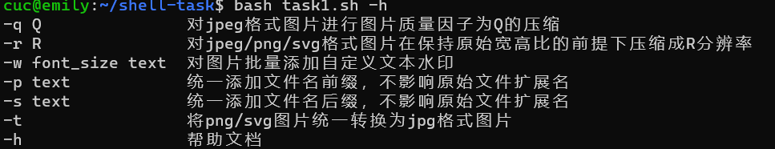
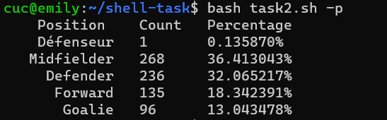

# 第四章实验:shell脚本编程基础
 ## 实验环境
 - Ubuntu 20.04 
 - VScode remote
 - imagemagick
 ## 完成情况
 - 任务一：用bash编写一个图片批处理脚本，实现以下功能：  
   - [x] 支持命令行参数方式使用不同功能
   - [x] 支持对指定目录下所有支持格式的图片文件进行批处理
   - [x] 支持以下常见图片批处理功能的单独使用或组合使用
     - [x] 支持对jpeg格式图片进行图片质量压缩
     - [x] 支持对jpeg/png/svg格式图片在保持原始宽高比的前提下压缩分辨率
     - [x] 支持对图片批量添加自定义文本水印
     - [x] 支持批量重命名（统一添加文件名前缀或后缀，不影响原始文件扩展名）
     - [x] 支持将png/svg图片统一转换为jpg格式图片

 - 任务二：用bash编写一个文本批处理脚本，对以下附件分别进行批量处理完成相应的数据统计任务：  
  [2014世界杯运动员数据](C:\LinuxSysAdmin\exp\chap0x04\worldcupplayerinfo.tsv)
   - [x] 统计不同年龄区间范围（20岁以下、[20-30]、30岁以上）的球员数量、百分比
   - [x] 统计不同场上位置的球员数量、百分比
   - [x] 名字最长的球员是谁？名字最短的球员是谁？
   - [x] 年龄最大的球员是谁？年龄最小的球员是谁？

 - 任务三：用bash编写一个文本批处理脚本，对以下附件分别进行批量处理完成相应的数据统计任务：
   [Web服务器访问日志](C:\LinuxSysAdmin\exp\chap0x04\web_log.tsv.7z)
   - [x] 统计访问来源主机TOP 100和分别对应出现的总次数
   - [x] 统计访问来源主机TOP 100 IP和分别对应出现的总次数
   - [x] 统计最频繁被访问的URL TOP 100
   - [x] 统计不同响应状态码的出现次数和对应百分比
   - [x] 分别统计不同4XX状态码对应的TOP 10 URL和对应出现的总次数
   - [x] 给定URL输出TOP 100访问来源主机

 ## 任务结果
   ### 任务一

   `bash task1.sh -h`  

   

   `bash task1.sh -q`  

   

   `bash task1.sh -r`  

   

   `bash task1.sh -w`  

   

   `bash task1.sh -p`  

   

   `bash task1.sh -s`  

   

   `bash task1.sh -t`  

   
    
  ### 任务二

  `bash task2.sh -h`  

   

   `bash task2.sh -s`  

   

   `bash task2.sh -p`  

   

   `bash task2.sh -n`  

   

   `bash task2.sh -a`  

   

  ### 任务三

   `bash task3.sh -h`  

   

   `bash task3.sh -o`  

   

   `bash task3.sh -i`  

   

   `bash task3.sh -u`  

   

   `bash task3.sh -c`  

   

   `bash task3.sh -f`  

   

   `bash task3.sh -g`  

   

 ## 问题
 ```
 convert-im6.q16: must specify image size `/tmp/magick-1691B2-HdCjuSxe3' @ error/mvg.c/ReadMVGImage/186.
 convert-im6.q16: no images defined `usefortask1.svg' @ error/convert.c/ConvertImageCommand/3258.
 ```

 ## 参考
 [awk详解](https://blog.csdn.net/jin970505/article/details/79056457?ops_request_misc=%257B%2522request%255Fid%2522%253A%2522161923428216780366546108%2522%252C%2522scm%2522%253A%252220140713.130102334..%2522%257D&request_id=161923428216780366546108&biz_id=0&utm_medium=distribute.pc_search_result.none-task-blog-2~all~sobaiduend~default-1-79056457.pc_search_result_no_baidu_js&utm_term=linux+awk%E5%91%BD%E4%BB%A4%E8%AF%A6%E8%A7%A3)  
 [convert命令](https://blog.csdn.net/qq_42303254/article/details/89528165)   
 [imagemagick工具](http://www.imagemagick.com.cn/commands.html)  
 [第四章课后答疑讨论区](http://courses.cuc.edu.cn/course/82669/learning-activity/full-screen#/248353#topic-254371)     
 [往年实验报告](https://github.com/CUCCS/2021-linux-public-Annna777/tree/chap0x04)    
 
