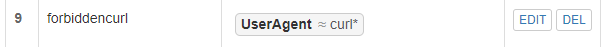

# 第五章实验
 ## 软件环境
 Nginx   
 VeryNginx  
 Wordpress  
 Damn Vulnerable Web Application (DVWA)
 ## 实验要求
 ### 基本要求
 - 在一台主机（虚拟机）上同时配置Nginx和VeryNginx
 - VeryNginx作为本次实验的Web App的反向代理服务器和WAF
 - PHP-FPM进程的反向代理配置在nginx服务器上，VeryNginx服务器不直接配置Web站点服务
 - 使用Wordpress搭建的站点对外提供访问的地址为： http://wp.sec.cuc.edu.cn
 - 使用Damn Vulnerable Web Application (DVWA)搭建的站点对外提供访问的地址为： http://dvwa.sec.cuc.edu.cn

 ### 安全加固要求
 - 使用IP地址方式均无法访问上述任意站点，并向访客展示自定义的友好错误提示信息页面-1
 - Damn Vulnerable Web Application (DVWA)只允许白名单上的访客来源IP，其他来源的IP访问均向访客展示自定义的友好错误提示信息页面-2
 - 在不升级Wordpress版本的情况下，通过定制VeryNginx的访问控制策略规则，热修复WordPress < 4.7.1 - Username Enumeration
 - 通过配置VeryNginx的Filter规则实现对Damn Vulnerable Web Application (DVWA)的SQL注入实验在低安全等级条件下进行防护
  
 ### VeryNginx配置要求
 - VeryNginx的Web管理页面仅允许白名单上的访客来源IP，其他来源的IP访问均向访客展示自定义的友好错误提示信息页面-3
 - 通过定制VeryNginx的访问控制策略规则实现：
   - 限制DVWA站点的单IP访问速率为每秒请求数 < 50
   - 限制Wordpress站点的单IP访问速率为每秒请求数 < 20
   - 超过访问频率限制的请求直接返回自定义错误提示信息页面-4
   - 禁止curl访问
 
 ## 实验过程

 - 修改宿主机hosts文件  
   

 ### verynginx  
 - 提前安装必要的库  
 ```
 sudo apt-get install zlib1g-dev
 sudo apt-get update 
 sudo apt-get install libpcre3 libpcre3-dev
 sudo apt install gcc
 sudo apt install make
 sudo apt install libssl-dev
 ```
 ```
 # 克隆VeryNginx仓库到本地
 git clone https://github.com/alexazhou/VeryNginx.git 
 # 执行安装程序，开始编译安装
 sudo python install.py install
 # 创建软链接
 sudo ln -s /opt/verynginx/openresty/nginx/sbin/nginx /usr/sbin/verynginx
 # 启动VeryNginx
 sudo verynginx
 ```
 - 修改配置文件  
 ```
 # 修改 `/opt/verynginx/openresty/nginx/conf/nginx.conf` 配置文件
 sudo vim /opt/verynginx/openresty/nginx/conf/nginx.conf

 # 用户名
 user  www-data;

 # 监听端口
 # 为了不和其他端口冲突，此处设置为8081
 server {
        listen 192.168.56.102:8081;
        
        #this line shoud be include in every server block
        include /opt/verynginx/verynginx/nginx_conf/in_server_block.conf;

        location = / {
            root   html;
            index  index.html index.htm;
        }
    }
 ```
 - 进程权限  
 `sudo chmod -R 777 /opt/verynginx/verynginx/configs`

 - 通过宿主机浏览器访问，访问成功
  
   
   
   
 
  ### nginx  
 - 安装   
 `sudo apt-get install nginx`  
 - 修改配置文件  
 `sdo vim /etc/nginx/sites-enabled/default`  
   
 
 ### wordpress  
 ```
 # 下载安装包
 sudo wget https://wordpress.org/wordpress-4.7.zip

 # 解压
 sudo apt install unzip
 unzip wordpress-4.7.zip

 # 将解压后的wordpress移至指定路径
 sudo mkdir /var/www/html/wp.sec.cuc.edu.cn
 sudo cp -r wordpress /var/www/html/wp.sec.cuc.edu.cn
 ```
 - 安装PHP和MySQL  
 mysql:  
  ```
  # 登录
 sudo mysql
 # 建库
 CREATE DATABASE wordpress DEFAULT CHARACTER SET utf8 COLLATE utf8_unicode_ci;
 # 创建用户
 create user 'emily'@'localhost' identified by 'cuc';
 # 授权
 grant all on wordpress.* to 'emily'@'localhost';
 # 退出
 exit
  ```
   

 - 进入`/var/www/html/wp.sec.cuc.edu.cn/wordpress`目录下修改文件
 
 `sudo vim wp-config-sample.php`
 
 ```
 // ** MySQL settings - You can get this info from your web host ** //
 /** The name of the database for WordPress */
 define('DB_NAME', 'wordpress');

 /** MySQL database username */
 define('DB_USER', 'emily');

 /** MySQL database password */
 define('DB_PASSWORD', 'cuc');

 /** MySQL hostname */
 define('DB_HOST', 'localhost');

 /** Database Charset to use in creating database tables. */
 define('DB_CHARSET', 'utf8');

 /** The Database Collate type. Don't change this if in doubt. */
 define('DB_COLLATE', '');
 ```
 - 建立连接  
 ```
  sudo nginx -t
  sudo systemctl reload nginx
  sudo systemctl restart nginx
  ```
 - 成功访问wordpress  
 
 

 ### DVWA  
 - 安装DVWA  
 ```
 # 下载
 git clone https://github.com/digininja/DVWA.git
 # 建立目录
 sudo mkdir /var/www/html/dvwa.sec.cuc.edu.cn
 # 移动文件夹内容至该目录下
 sudo mv DVWA/* /var/www/html/dvwa.sec.cuc.edu.cn
 # 修改文件夹属主为 www-data
 sudo chown -R www-data:www-data /var/www/html/dvwa.sec.cuc.edu.cn
 ```
 - 配置mysql  
 ```
 # 启动MySQL
 sudo mysql

 # 建立dvwa的数据库
 create database dvwa;

 # 创建用户
 create user dvwa@localhost identified by 'p@ssw0rd';

 # 授权
 grant all on dvwa.* to dvwa@localhost;

 # 刷新权限
 flush privileges;

 # 退出
 exit

 # 重启mysql使配置文件生效
 sudo systemctl restart mysql
 ```
   

 - 配置PHP  
 ```
 # 进入/var/www/html/dvwa.sec.cuc.edu.cn/config/目录下的config.inc.php.dist文件
 # 改名为config.inc.php
 sudo mv config.inc.php.dist config.inc.php
 ```
 修改php-fpm文件
 ```
 sudo vim /etc/php/7.4/fpm/php.ini

 # 修改内容
 allow_url_include = On
 ```
 重启  
 `sudo systemctl restart php7.4-fpm.service`  

 - 配置服务器  
 ```
 sudo vim /etc/nginx/sites-available/dvwa.sec.cuc.edu.cn

 # 写入
 server {
    listen 8080 default_server;
    listen [::]:8080 default_server;
	
    root /var/www/html/dvwa.sec.cuc.edu.cn;
    index index.php index.html index.htm index.nginx-debian.html;
    server_name dvwa.sec.cuc.edu.cn;

    location / {
        #try_files $uri $uri/ =404;
        try_files $uri $uri/ /index.php$is_args$args;  
    }

    location ~ \.php$ {
        include snippets/fastcgi-php.conf;
        fastcgi_pass unix:/var/run/php/php7.4-fpm.sock;
    }

    location ~ /\.ht {
        deny all;
    }
 }
 ```  

 创建软连接  
 `sudo ln -s /etc/nginx/sites-available/dvwa.sec.cuc.edu.cn /etc/nginx/sites-enabled/`

 检查并重启Nginx服务    
 ```
 sudo nginx -t
 sudo systemctl restart nginx
 ```
 
 - 成功登录DVWA    
   
 用户名：dvwa 密码：p@ssw0rd
   
 创建数据库，点击login.php页面下方的Create/Reset Database生成需要使用的数据库。如果数据库连接成功，页面会直接重定向到登录页面，此时使用admin/password登录
   
 
 ### 反向代理  
     
     

 ### 安全加固要求  
 - （1）使用IP地址方式均无法访问上述任意站点，并向访客展示自定义的友好错误提示信息页面-1  
   
   
   
   

 - Damn Vulnerable Web Application (DVWA)只允许白名单上的访客来源IP，其他来源的IP访问均向访客展示自定义的友好错误提示信息页面-2
   
   
    

 - （2）在不升级Wordpress版本的情况下，通过定制VeryNginx的访问控制策略规则，热修复WordPress < 4.7.1 - Username Enumeration
 添加matcher    
     
 添加filter    
   

 - （3）通过配置VeryNginx的Filter规则实现对Damn Vulnerable Web Application (DVWA)的SQL注入实验在低安全等级条件下进行防护
 登录DVWA，选择`DVWA Security`中的`Security Level`为`Low`  
    
 添加matcher  
    
 添加filter  
    

  ### VeryNginx配置要求
 - VeryNginx的Web管理页面仅允许白名单上的访客来源IP，其他来源的IP访问均向访客展示自定义的友好错误提示信息页面-3
 添加matcher   
    
 测试结果  
   

 - 通过定制VeryNginx的访问控制策略规则实现：
   - 限制DVWA站点的单IP访问速率为每秒请求数 < 50
   - 限制Wordpress站点的单IP访问速率为每秒请求数 < 20
   - 超过访问频率限制的请求直接返回自定义错误提示信息页面-4
 添加 frequency limit  
   
 使用ab压力测试工具  
 ```
 sudo apt update
 sudo apt install apache2-utils 
 ```
 测试 wp.sec.cuc.edu.cn    
 `ab -n 100 http://wp.sec.cuc.edu.cn/`    
   
 测试 dvwa.sec.cuc.edu.cn  
 `ab -n 100 http://dvwa.sec.cuc.edu.cn/`    
     
 
   - 禁止curl访问  

 添加matcher  
     
 添加filter  
    

 ## 问题及解决  
 - 解决Nginx下WordPress后台404的问题  
 修改配置文件  
 ```
 location / {
        if (-f $request_filename/index.html){
               rewrite (.*) $1/index.html break;
        }
        if (-f $request_filename/index.php){
               rewrite (.*) $1/index.php;
         }
        if (!-f $request_filename){
               rewrite (.*) /index.php;
         }
 }
 rewrite /wp-admin$ $scheme://$host$uri/ permanent;
 ```
 
 - 问题 多个站点共用80端口  
 ```
 # 修改内容
 listen 8082 default_server;
 listen [::]:8082 default_server;
 ``` 

 - 执行ab命令报错  
 ` Name or service not known (670002)`  
    
 ```  
 # 编辑虚拟机的hosts文件
 sudo vim /etc/hosts
 #添加
 192.168.56.101 vn.sec.cuc.edu.cn
 192.168.56.101 dvwa.sec.cuc.edu.cn
 192.168.56.101 wp.sec.cuc.edu.cn
 ```

 ## 参考
 [Nginx下WordPress后台404的问题](http://t.zoukankan.com/manongxiaobing-p-4638205.html)  
 [多个站点共用端口](https://stackoverflow.com/questions/60362642/nginx-doesnt-listen-on-port-80-twice/61360297#61360297)  
 [verynginx](https://github.com/alexazhou/VeryNginx)  
 [往年实验报告](https://github.com/CUCCS/2021-linux-public-cuczbj/tree/chapter0x05/Chap0x05)
